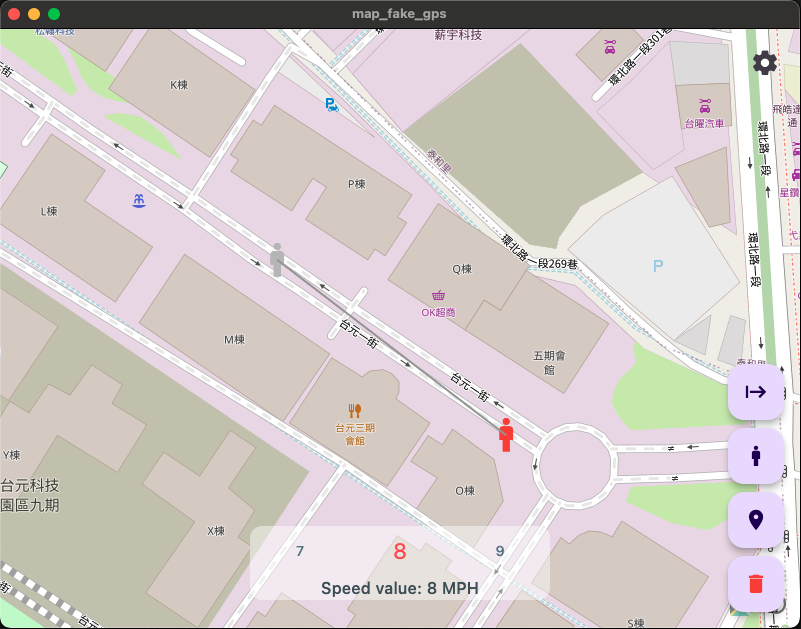
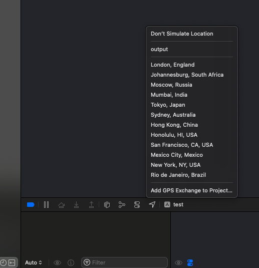

# flutter_map_fake_gps

Map_fake_gps is a tool used to create a GPX file for simulating location in Xcode.

**Env**

* MacOS 14.3
* Flutter 3.19.1, Dart 3.3.0
* Xcode Version 15.2

## Getting Started

* App Preview ( Tha app installer is at /installer/dmg_creator/mapGps.dmg  )

* How to simulate location on iphone.

1. Click the settings button to check the repository path for the generated GPX file (output.gpx).
2. Click on the map to set the starting and ending points for your simulation.
3. Click the start button (the first button in the toolbar) to save the GPX file.
4. Open Xcode and run any project on your mobile device. Then, click the navigator icon button -> "Add GPS Exchange to Project" and select the GPX file created by this tool.

   
5. You will then be able to control the location on your mobile device.

***MIT License
Copyright (c) 2024 StevenChang***
